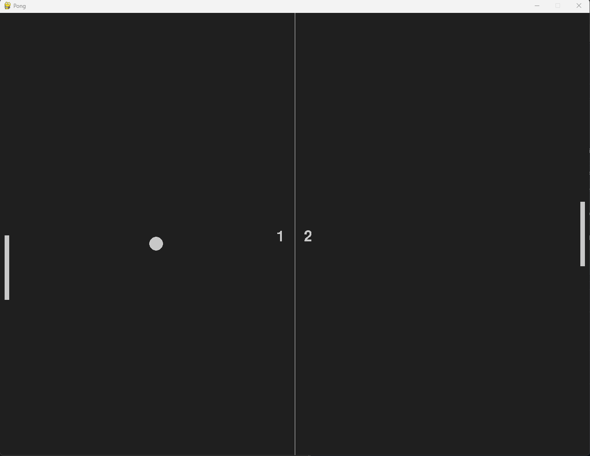

# pygame-pong
A pong game

This little project is part of a Pygame Study, it's a Pong game.

How to run:

Create a virtual environment with: 

    python -m venv venv

Activate the virtual environment with:

Windows venv activation

In cmd.exe

    venv\Scripts\activate.bat

In PowerShell

    venv\Scripts\Activate.ps1

Linux and MacOS venv activation

    $ source myvenv/bin/activate

Install requirements.txt with:

    pip install -r .\requirements.txt

Run the script main.py.

How to play the game:

upward arrow: &#8593;  
downward arrow: &#8595;  

 

 
